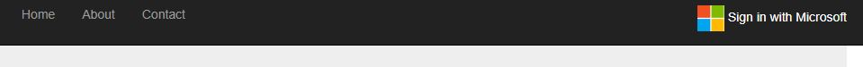
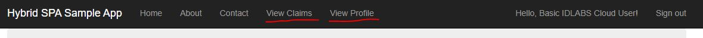
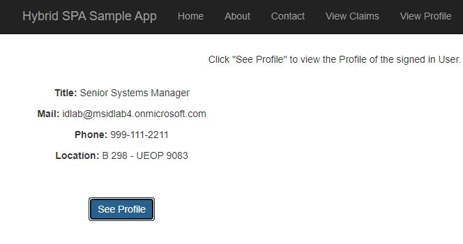

# hybridSPA

## Problem Description

Some applications like SharePoint and OWA are built as "hybrid" web applications, which are built with server-side and client-side components (e.g. an ASP.net  web application hosting a React single-page application). In these scenarios, the application will likely need authentication both client-side (e.g. a public client using MSAL.js) and server-side (e.g. a confidential client using MSAL.net ), and each application context will need to acquire its own tokens. This requires that the application complete two round-trips to the eSTS /authorize endpoint, one to get tokens for the confidential client, and a second to get tokens for the public client. Historically, the second leg of this flow is done silently via the implicit flow (e.g. ADAL.js or MSAL.js v1). However, when third-party cookies are blocked in the user's browser due to the browser's privacy features (e.g. Safari ITP), MSAL.js is unable to complete the second round-trip to the /authorize endpoint silently, resulting in the application needing to prompt the user to interactively navigate to the /authorize endpoint (via popup or full-page redirect) to complete authentication for the public client. And while MSAL.js v2 does not require third-party cookies for silent token renewal, it still relies on third-party cookies to silently authenticate the user when the application first loads.

## Hybrid SPA sample application

This sample demonstrates how to use MSAL.js v2 and MSAL .Net together in a "hybrid" application that performs both server-side and client-side authenication. 

It shows how to use two new APIs, `WithSpaAuthorizationCode` on `AcquireTokenByAuthorizationCode` in MSAL .Net and `acquireTokenByCode` in MSAL.js v2, to authenticate a user server-side using a confidential client, and then SSO that user client-side using a second authorization code that is returned to the confidential client and redeemed by the public client client-side. This helps mitigate user experience and performance concerns that arise when performing server-side and client-side authentication for the same user, especially when third-party cookies are blocked by the browser.

## Sample Overview

The application is implemented as an ASP.NET MVC project, while the web sign-on functionality is implemented via ASP.NET OpenId Connect OWIN middleware.

The sample also shows how to use [MSAL.js V2 (Microsoft Authentication Library for JavaScript)](https://github.com/AzureAD/microsoft-authentication-library-for-js) to obtain an access token for Microsoft Graph. Specifically, the sample shows how to get the profile of the user from Microsoft Graph.

You can also use the [MSAL Browser sample](https://github.com/AzureAD/microsoft-authentication-library-for-js/tree/dev/samples/msal-browser-samples/HybridSample) that demonstrates how to use MSAL.js v2 and MSAL Node together in a "hybrid" application that performs both server-side and client-side authenication

## How To Run This Sample

To run this sample, you'll need:

- [Visual Studio 2019](https://aka.ms/vsdownload)
- An Internet connection
- An Azure AD account

You can get an Office365 office subscription, which will give you both an Azure AD account and a mailbox, at [https://products.office.com/en-us/try](https://products.office.com/en-us/try).

### Step 1:  Clone or download this repository

From your shell or command line:

```Shell
git clone https://github.com/gladjohn/hybridSPA.git
```
### Step 2:  Register the sample application with your Azure Active Directory tenant

1. Clone the source code from the git repo.
2. In the Azure Portal, create a new app registration.
3. In the root `web.config` on this sample, add the client id for this application as `ClientId`.
4. Add your application authority (e.g. `https://login.microsoftonline.com/<tenant GUID>`) to the `web.config` file as `Authority`.
5. In the Azure Portal, under the **Authentication** tab for your application, add the following **Web** redirect URIs:
    1. `https://localhost:44320`
6. Also add the following **Single-page application** redirect URIs:
    1. `https://localhost:44320/auth/client-redirect`
7. Under **Implicit grant and hybrid flows**, check the boxes to enable **Access tokens** and **ID tokens**.
8. Under the **Certificats & secrets** tab, create a new client secret. Add this client secret to the `web.config` file as `ClientSecret`.
9. In the manifest editor, add the following optional ID token claims:
    1. `sid`
    1. `login_hint`
10. Under the **API permissions** tabs, add the `User.Read` scope from Microsoft Graph.
11. Build the application and click Start.

#### Configure the service project

1. Open the solution in Visual Studio.
1. Open the `web.config` file.
1. Find the app key `ClientId` and replace the existing value with the application ID (clientId) of the application copied from the Azure portal.
1. Find the app key `ClientSecret` and replace the existing value with the key you saved during the creation of the app, in the Azure portal.

## Sample web.config 
```config
  <appSettings>
    <add key="webpages:Version" value="3.0.0.0" />
    <add key="webpages:Enabled" value="false" />
    <add key="ClientValidationEnabled" value="true" />
    <add key="UnobtrusiveJavaScriptEnabled" value="true" />
    <add key="ClientId" value="<Replace with your Application/Client ID>" />
    <add key="ClientSecret" value="<Replace with your App Secret>" />
    <add key="AADInstance" value="https://login.microsoftonline.com/{0}{1}" />
    <add key="redirectUri" value="https://localhost:44320" />
    <add key="Tenant" value="organizations" /> <!-- Set value to "common" if you are using a Multi Tenant App -->
  </appSettings>
```  
#### Configure the SPA 

1. Open the solution in Visual Studio.
1. Open the `hybridspa.js` file.
1. Find the app key `clientId` and replace the existing value with the application ID (clientId) of the application copied from the Azure portal.

> Note : Both Web.Config and this Client ID should be the same.

## Sample hybridspa.js
```js
const msalInstance = new msal.PublicClientApplication({
    auth: {
        clientId: "<same client id from the web.config>",
        redirectUri: "https://localhost:44320/auth/client-redirect",
        authority: "https://login.microsoftonline.com/organizations/v2.0"
    }
})
```  

### Step 3:  Run the sample

Clean the solution, rebuild the solution, and run it.

Once you run the `Hybrid SPA` web application, you are presented with the standard ASP.NET home page.
Click on the **Sign-in with Microsoft** link on top-right to trigger the log-in flow.



On the sign-in page, enter the name and password of a work/school account. 

As you sign in, the app will change the sign-in button into a greeting to the current user - and two new menu commands will appear: `View Claims` and `View Profile`.



Click on **View Profile**: the app will show the profile of the current user, as they are received from the Microsoft Graph.



> The sample redeems the Spa Auth Code from the initial token aquisition. You will need to sign-out and sign back in to request the SPA Auth Code.
> If you want to add more client side functionallity, please refer to the [MSAL JS Browser Sample for Hybrid SPA](https://github.com/AzureAD/microsoft-authentication-library-for-js/tree/dev/samples/msal-browser-samples/HybridSample)

> Did the sample not work for you as expected? Did you encounter issues trying this sample? Then please reach out to us using the [GitHub Issues](https://github.com/gladjohn/hybridSPA/issues) page.


## About the code

Here is a quick guide to the most interesting authentication-related bits of the sample.

### Sign in

As it is a standard practice for ASP.NET MVC apps, the sign-in functionality is implemented with the OpenID Connect OWIN middleware. Here is the relevant snippet from the middleware initialization:

```CSharp
app.UseOpenIdConnectAuthentication(
                new OpenIdConnectAuthenticationOptions
                {
                    // The `Authority` represents the v2.0 endpoint - https://login.microsoftonline.com/common/v2.0
                    Authority = AuthenticationConfig.Authority,
                    ClientId = AuthenticationConfig.ClientId,
                    RedirectUri = AuthenticationConfig.RedirectUri,
                    PostLogoutRedirectUri = AuthenticationConfig.RedirectUri,
                    Scope = AuthenticationConfig.BasicSignInScopes + " Mail.Read", 
                    TokenValidationParameters = new TokenValidationParameters
                    {
                        ValidateIssuer = false,
                        // In a real application you would use IssuerValidator for additional checks, like making sure the user's organization has signed up for your app.
                        //     IssuerValidator = (issuer, token, tvp) =>
                        //     {
                        //        //if(MyCustomTenantValidation(issuer))
                        //        return issuer;
                        //        //else
                        //        //    throw new SecurityTokenInvalidIssuerException("Invalid issuer");
                        //    },
                        NameClaimType = "name",
                        SaveSigninToken = true,
                    },
                    Notifications = new OpenIdConnectAuthenticationNotifications()
                    {
                        AuthorizationCodeReceived = OnAuthorizationCodeReceived,
                        AuthenticationFailed = OnAuthenticationFailed,
                        RedirectToIdentityProvider = OnRedirectToIdentityProvider,
                    },
                    // Handling SameSite cookie according to https://docs.microsoft.com/en-us/aspnet/samesite/owin-samesite
                    CookieManager = new SameSiteCookieManager(new SystemWebCookieManager())
                });
```

Important things to notice:

- The Authority points to the new authentication endpoint.
- the list of scopes includes both entries that are used for the sign-in function (`openid, email, profile`) and for the token acquisition function (`offline_access` is required to obtain refresh_tokens as well; `User.Read` is required for getting access tokens that can be used when requesting to read the user's profile from Microsoft Graph).
- In this sample, the issuer validation is turned off, which means that anybody with an account can access the application. Real life applications would likely be more restrictive, limiting access only to those Azure AD tenants or Microsoft accounts associated to customers of the application itself. In other words, real life applications would likely also have a sign-up function - and the sign-in would enforce that only the users who previously signed up have access. For simplicity, this sample does not include sign up features.

### Initial token acquisition

This sample makes use of OpenId Connect hybrid flow, where at authentication time the app receives both sign in info, the  [id_token](https://docs.microsoft.com/en-us/azure/active-directory/develop/id-tokens)  and artifacts (in this case, an  [authorization code](https://docs.microsoft.com/en-us/azure/active-directory/develop/v2-oauth2-auth-code-flow)) that the app can use for obtaining an [access token](https://docs.microsoft.com/en-us/azure/active-directory/develop/access-tokens). This access token can be used to access other resources - in this sample, the Microsoft Graph, for the purpose of reading the user's mailbox.

This sample shows how to use MSAL to redeem the authorization code into an access token, which is saved in a cache along with any other useful artifact (such as associated  [refresh_tokens](https://docs.microsoft.com/en-us/azure/active-directory/develop/v2-oauth2-auth-code-flow#refresh-the-access-token)) so that it can be used later on in the application from the controllers' actions to fetch access tokens after they are expired.

The redemption takes place in the `AuthorizationCodeReceived` notification of the authorization middleware. This is the section where the new MSAL.Net `WithSpaAuthorizationCode` API is used to get the `SpaAuthCode` Here there's the relevant code:

```CSharp
private async Task OnAuthorizationCodeReceived(AuthorizationCodeReceivedNotification context)
        {
            try
            {
                // Upon successful sign in, get the access token & cache it using MSAL
                IConfidentialClientApplication clientApp = MsalAppBuilder.BuildConfidentialClientApplication();
                AuthenticationResult result = await clientApp.AcquireTokenByAuthorizationCode(new[] { "user.read" }, context.Code)
                    .WithSpaAuthorizationCode(true)
                    .ExecuteAsync();

                HttpContext.Current.Session.Add("Spa_Auth_Code", result.SpaAuthCode);
            }
            catch
            {
 
            }
        }
```

Important things to notice:

- The  `IConfidentialClientApplication`  is the primitive that MSAL uses to model the Web application. As such, it is initialized with the main application's coordinates.
- The scope requested by  `AcquireTokenByAuthorizationCode`  is just the one required for invoking the API targeted by the application as part of its essential features. 

The IConfidentialClientApplication is created in a separate function in the `MsalAppBuilder` class.

```Csharp
        public static IConfidentialClientApplication BuildConfidentialClientApplication()
        {
            if (clientapp == null)
            {
                clientapp = ConfidentialClientApplicationBuilder.Create(AuthenticationConfig.ClientId)
                      .WithClientSecret(AuthenticationConfig.ClientSecret)
                      .WithRedirectUri(AuthenticationConfig.RedirectUri)
                      .WithAuthority(new Uri(AuthenticationConfig.Authority))
                      .WithExperimentalFeatures()
                      .Build();
            }
            return clientapp;
        }
```

Important things to notice:

- The method builds an instance of the IConfidentialClientApplication using the new [builder pattern introduced by MSAL v3.X](https://github.com/AzureAD/microsoft-authentication-library-for-dotnet/wiki/Client-Applications).

### Using Spa Auth Code in the Front End

First, configure a new PublicClientApplication from MSAL.js in your single-page application:

Source: [Scripts/HybridSPA.js#L1](./HybridSPA/Scripts/HybridSPA.js#L1)

```JS
const msalInstance = new msal.PublicClientApplication({
    auth: {
        clientId: "{{clientId}}",
        redirectUri: "http://localhost:3000/auth/client-redirect",
        authority: "{{authority}}"
    }
})
```

Next, render the code that was acquired server-side, and provide it to the acquireTokenByCode API on the MSAL.js PublicClientApplication instance. Be sure to not include any additional scopes that were not included in the first login request, otherwise the user may be prompted for consent.

The application should also render any account hints, as they will be needed for any interactive requests to ensure the same user is used for both requests

Source: [Scripts/HybridSPA.js#L113](./HybridSPA/Scripts/HybridSPA.js#L113)

```js
const code = "{{code}}";
const loginHint = "{{loginHint}}";

const scopes = [ "user.read" ];

return msalInstance.acquireTokenByCode({
    code,
    scopes
})
    .catch(error => {
         if (error instanceof msal.InteractionRequiredAuthError) {
            // Use loginHint/sid from server to ensure same user
            return msalInstance.loginRedirect({
                loginHint,
                scopes
            })
        }
    });
```

Once the Access Token is retrieved using the new MSAL.js `acquireTokenByCode` api, the token is then used to read the user's profile 

Source: [Scripts/HybridSPA.js#L84](./HybridSPA/Scripts/HybridSPA.js#L84)

```js
function callMSGraph(endpoint, token, callback) {
    const headers = new Headers();
    const bearer = `Bearer ${token}`;
    headers.append("Authorization", bearer);

    const options = {
        method: "GET",
        headers: headers
    };

    console.log('request made to Graph API at: ' + new Date().toString());

    fetch(endpoint, options)
        .then(response => response.json())
        .then(response => callback(response, endpoint))
        .then(result => {
            console.log('Successfully Fetched Data from Graph API:', result);
        })
        .catch(error => console.log(error))
}
```

## Community Help and Support

Use [Stack Overflow](http://stackoverflow.com/questions/tagged/msal) to get support from the community.
Ask your questions on Stack Overflow first and browse existing issues to see if someone has asked your question before.
Make sure that your questions or comments are tagged with [`msal` `dotnet` `microsoft-graph`].

If you find a bug in the sample, please raise the issue on [GitHub Issues](../../issues).

To provide a recommendation, visit the following [User Voice page](https://feedback.azure.com/forums/169401-azure-active-directory).

## Contributing

If you'd like to contribute to this sample, see [CONTRIBUTING.MD](/CONTRIBUTING.md).

This project has adopted the [Microsoft Open Source Code of Conduct](https://opensource.microsoft.com/codeofconduct/). For more information, see the [Code of Conduct FAQ](https://opensource.microsoft.com/codeofconduct/faq/) or contact [opencode@microsoft.com](mailto:opencode@microsoft.com) with any additional questions or comments.

## More information

For more information, visit the following links:

- [Add sign-in with Microsoft to an ASP.NET web app (V2 endpoint)](https://docs.microsoft.com/en-us/azure/active-directory/develop/guidedsetups/active-directory-aspnetwebapp) explains how to re-create the sign-in part of this sample from scratch.
- [MSAL Browser sample](https://github.com/AzureAD/microsoft-authentication-library-for-js/tree/dev/samples/msal-browser-samples/HybridSample) that demonstrates how to use MSAL.js v2 and MSAL Node together in a "hybrid" application that performs both server-side and client-side authenication
- To learn more about the code, visit [Conceptual documentation for MSAL.NET](https://github.com/AzureAD/microsoft-authentication-library-for-dotnet/wiki#conceptual-documentation) and in particular:

  - [Acquiring tokens with authorization codes on web apps](https://github.com/AzureAD/microsoft-authentication-library-for-dotnet/wiki/Acquiring-tokens-with-authorization-codes-on-web-apps)
  - [Customizing Token cache serialization](https://github.com/AzureAD/microsoft-authentication-library-for-dotnet/wiki/token-cache-serialization)
  - [Acquiring a token on behalf of a user Service to Services calls](https://github.com/AzureAD/microsoft-authentication-library-for-dotnet/wiki/on-behalf-of) 

- Articles about the Azure AD V2 endpoint [http://aka.ms/aaddevv2](http://aka.ms/aaddevv2), with a focus on:

  - [Azure Active Directory v2.0 and OAuth 2.0 On-Behalf-Of flow](https://docs.microsoft.com/en-us/azure/active-directory/develop/active-directory-v2-protocols-oauth-on-behalf-of)
  - [Incremental and dynamic consent](https://docs.microsoft.com/en-us/azure/active-directory/develop/active-directory-v2-compare#incremental-and-dynamic-consent)

- Articles about the Microsoft Graph
  - [Overview of Microsoft Graph](https://developer.microsoft.com/en-us/graph/docs/concepts/overview)
  - [Get access tokens to call Microsoft Graph](https://developer.microsoft.com/en-us/graph/docs/concepts/auth_overview)
  - [Use the Microsoft Graph API](https://developer.microsoft.com/en-us/graph/docs/concepts/use_the_api)
